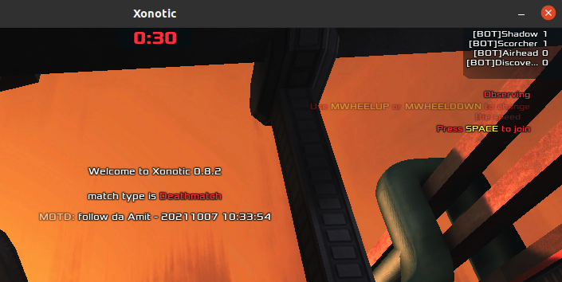

# Demo for Mountkirk Games

## tl;dr

Login to [GCP console](https://console.cloud.google.com), create a new project, launch cloud shell, then:

    $ git clone https://github.com/sodesune/mountkirk
    $ cd mountkirk
    $ make

This setup [Google Cloud Game Servers](https://cloud.google.com/game-servers) using [Xonotic](https://xonotic.org/) as example.

It also setup telemetry: 
- GKE logs > cloud logging > pubsub > dataflow > bigquery

To simulate random headless xonotic clients connecting the gameserver:

    $ make simulation

To demo development (modify xonotic server.cfg in gcr.io):

    $ make dev

To clean up **(Caution: this also removes ALL storage resources, if exists earlier)**:

    $ make clean
    $ make veryclean (optional)

**Note: Many cloud shell commands used here takes a long time to complete. Please be patient!**

## Details

[Mountkirk Games](./assets/master_case_study_mountkirk_games.pdf) [as of Oct/2021] - One of case studies for Google PCA exam.

### GKE/ Agones/ GCGS

Google Cloud Game Servers (GCGS) is recommended for Mountkirk Games. It fully manages [Agones](https://agones.dev/site/), an open source game server management project that runs on k8s. It automatically scales fleet for daily peaks, game events, or content drops, and easily manage multiple versions of server code.

Why Agones? As this [blog](https://www.fairwinds.com/blog/hands-on-with-agones-google-cloud-game-servers) summerizes:

> 1. The fact that the gameserver pod must be uninterrupted during a specified time means that we can't go killing the pod because of autoscaling, draining, or any other reason. In order to handle this, the gameserver manages the pod lifecycle in a way that a deployment never could. Agones introduces several states for the gameserver, and the game code itself is able to update that status via the Agones API ...
>
> 2. This is also an issue when running multiple gameservers in Kubernetes due to the possibility of port exhaustion. We need a way to allocate a lot of different ports that can be used by the gameservers. Agones handles this seamlessly with its DynamicPort allocation strategy ...

For overview of cloud game intra, see [here](https://cloud.google.com/architecture/cloud-game-infrastructure).

```bash
$ make
```

This creates GCGS using Xonotic as example. See: <https://cloud.google.com/architecture/deploying-xonotic-game-servers>

### Game analytics/ telemetry 

The above also setup gaming analytics telemetry as described [here](https://cloud.google.com/architecture/mobile-gaming-analysis-telemetry). Real-time events from xonotic server is captured by cloud logging (aka stackdriver logging), then > pubsub > dataflow > bigquery.

[stackdriverdataflowbigquery.py](./stackdriverdataflowbigquery.py) (adapter from: [here](https://github.com/GoogleCloudPlatform/dialogflow-log-parser-dataflow-bigquery/blob/master/stackdriverdataflowbigquery.py)) illustrates how dataflow job is used to filter + transform:

```python
def myfilter(d):
    try:
        return d['logName'].endswith('/logs/stdout') \
                and 'connected\u001b[m' in d['textPayload'] \
                and not d['textPayload'].startswith('[BOT]')
    except:
        pass
    return False

def mytransform(d):
    retval = {
        'insertId'      : None,
        'timestamp'     : None,
        'player'        : None, # cl_name
        'action'        : None, # connected/ disconnected
        'textPayload'   : None,
    }

    try:
        retval['insertId'] = d['insertId']
        retval['timestamp'] = d['timestamp']
        retval['textPayload'] = d['textPayload']

        player, text = d['textPayload'].split('\u001b', 1)
        retval['player'] = player
        retval['action'] = 'disconnected' if 'disconnected' in text else 'connected'
    except:
        pass

    return retval
```

### Testing w/ local xonotic client (optional)

```bash
make fw MY_CIDR=<my-public-ip-address>/32
```

This setup firewall rule to allow connection from your local xonotic client to gameserver.

```bash
make info
```

This shows the ip:port of gameserver. Then proceed to [download xonotic](https://xonotic.org/download/) client.

Linux (terminal):

```bash
cd path/to/xonotic
./xonotic-linux-sdl.sh +connect <server-ip:port> +_cl_name player123

```

Windows (command prompt - *untested*):
```bash
cd path\to\xonotic
xonotic.exe +connect <server-ip:port> +_cl_name player123
```

### Simulation

```bash
make simulation
```

This generates 15 random headless xonotic clients *(in cloud shell)* in 5 mins connecting/disconnecting to gameserver. The events take some time (*few minutes*) to show up in bigquery (only initially). Data studio can be further used to plot connection vs timeseries graph.

### Dev/ CD-CI

See discussion [here](https://cloud.google.com/architecture/continuous-delivery-jenkins-kubernetes-engine).

```bash
make dev
```

Here we just modify xonotic's [server.cfg](./dev/server.cfg). In [dev/build_image.sh](./dev/build_image.sh):

```bash
message="follow da Amit - `date +'%Y%m%d %H:%M:%S'`"
...
sed -i "s/^sv_motd.*/sv_motd \"$message\"/" server.cfg
gcloud builds submit --tag $image_tag .
```

[dev/Dockerfile](./dev/Dockerfile) (adapted from: [here](https://github.com/googleforgames/agones/blob/release-1.17.0/examples/xonotic/Dockerfile)):

```docker
FROM debian:stretch

RUN useradd -u 1000 -m xonotic
WORKDIR /home/xonotic

COPY Xonotic Xonotic
COPY wrapper wrapper
COPY server.cfg .xonotic/data/server.cfg

RUN rm -rf Xonotic/{xonotic-linux64-glx,xonotic-linux64-sdl,xonotic-linux-glx.sh,xonotic-linux-sdl.sh,.xonotic-*,data/xonotic-20170401-music.pk3}

RUN chown -R xonotic:xonotic .


USER 1000
ENTRYPOINT /home/xonotic/wrapper -i /home/xonotic/Xonotic/server_linux.sh
```

Upon completion, new **server ip:port** will be allocated. Launch your local xonotic client, and you should see something like:
<br>
<br>



*(Note: for unknown reason/s related to xonotic, you may need to launch xonotic client a couple of times...)*

# Other useful refs

- <https://www.youtube.com/watch?v=UFZCnhJtYd8>
- <https://www.youtube.com/watch?v=L_-1-8c3qrw>
- <https://www.youtube.com/watch?v=1w1olPjlPZY>

# License

Apache License, Version 2.0 (for respective module/s from Google, Inc.)